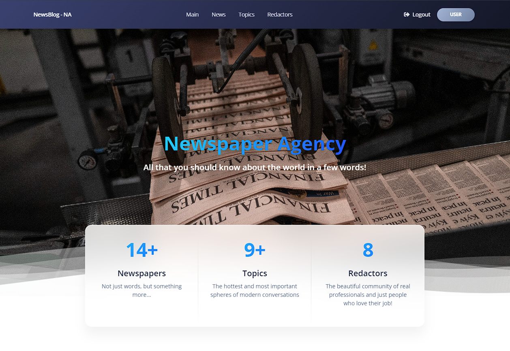

# Newspaper Agency Project

Django project for managing news and authors in agency

## Check it

[Project deployed to Render](https://nazar-newspaper-agency.onrender.com/)

## Account for testing:
```shell
Login: user
Password: user12345
```

## Installation

Python3 mast be already installed 

```shell
git clone https://github.com/NazarHladaniuk/newspaper-agency.git
python -m venv venv
venv\Scripts\activate (on Windows)
source venv/bin/activate (on macOS)
pip install -r requirements.txt
python manage.py loaddata task_manager_db_data.json
python manage.py runserver

```
## Demo


